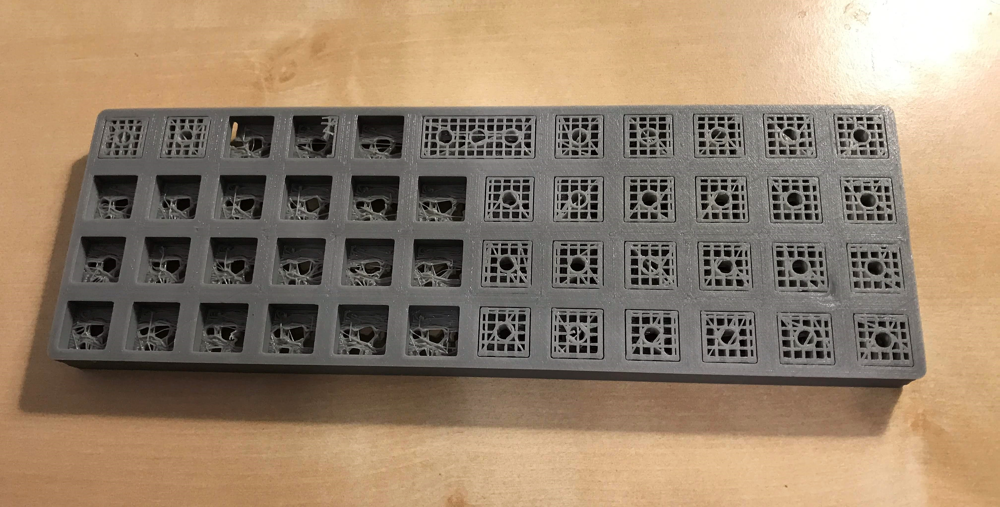
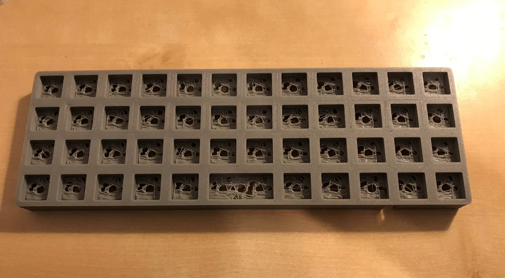
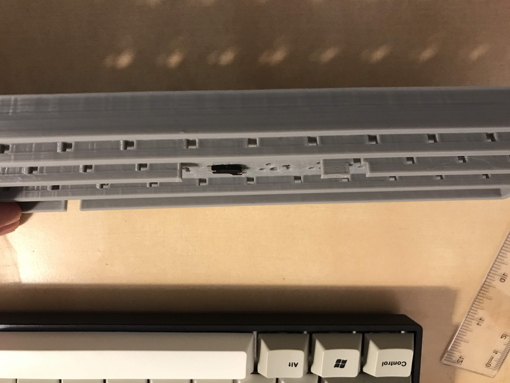
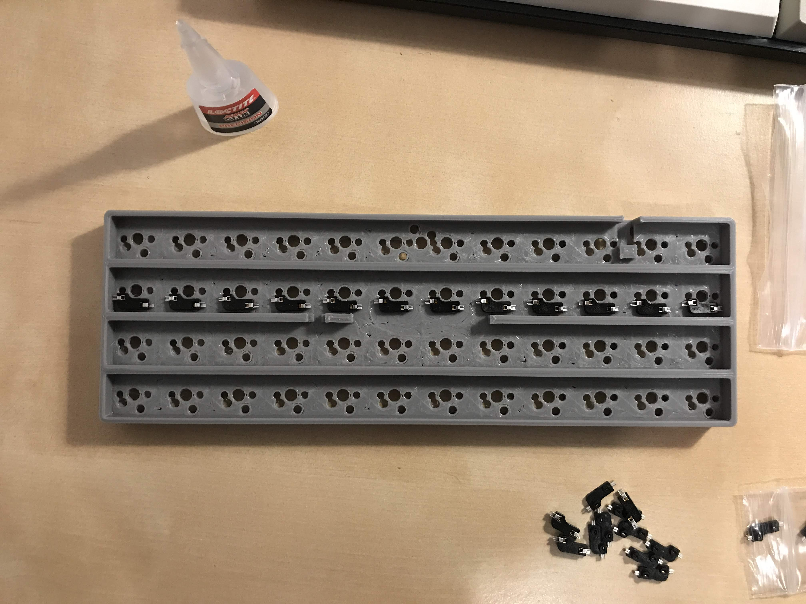
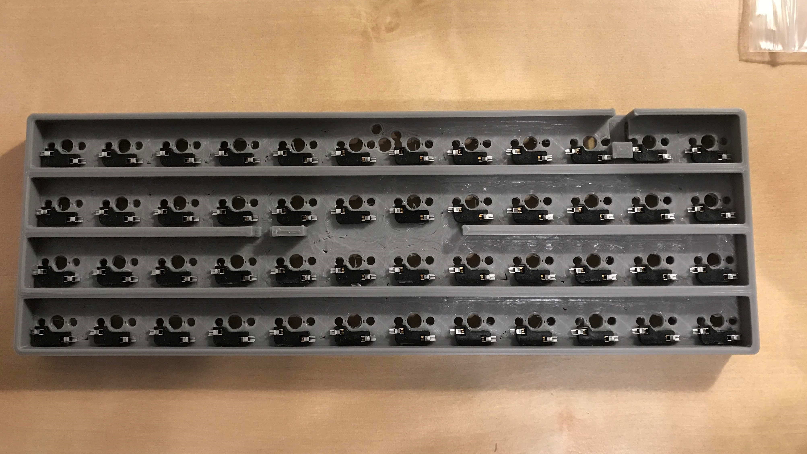

# Assembling Planckton

## 1. Preparing the PCB 
 

Once you have printed your PCB, the first thing is to pry out the excess plastic in the switch slots. They are fairly easy to pull out, I used a pair of [flush pliers](https://www.aliexpress.com/item/P00337-Electrical-Wire-Cable-Cutters-Cutting-Side-Snips-Flush-Pliers-Nipper-Hand-Tools-Herramientas/32686834481.html?spm=2114.search0104.3.9.99665f6eQu8w5k&ws_ab_test=searchweb0_0,searchweb201602_5_10065_10068_10130_10547_319_317_10548_10696_10192_10190_453_10084_454_10083_10618_10307_10820_10301_10821_538_10303_537_536_10059_10884_10887_100031_321_322_10103,searchweb201603_2,ppcSwitch_0&algo_expid=9b10be04-4f9c-4a78-b933-385b893fbfa9-1&algo_pvid=9b10be04-4f9c-4a78-b933-385b893fbfa9):

Once you've finished, your PCB will look like below: 

Next thing (this is somewhat dependent on your print quality), I suggest with a screw driver go through/poke through each of the holes and ensure they're all clear. You don't want any of your filament to be covering the hole as this will make it harder for your hotswap sockets and switches to go in. 

Once you've cleared the holes, using some sand paper, sand down each of the housings to ensure the excess plastic gets shredded off. This will ensure the switch is nice and flush.

---

## 2. Gluing the Hotswap sockets
Next step is to glue our hotswap sockets. Since the sockets are quite small, getting a glue with a 'precision' end will make this a bit easier. You'll notice that your socket will slot in perfectly like shown below: 

Once you've figured out hot they fit, start gluing!

> In the current revision there was a slight issue with the far left row lacking a bit of space for the sockets. The fix is to increase spacing by 1/2mm or so, but as a short-term fix, you can clip some of the sockets or just brute force it in.  

> Also note the socket closest to where the power cable will slot in the plastic house. The house was added in revision 2, due to an issue with unplugging the power cable causing the microcontroller micro usb to snap clean off!

Once you're done, your PCB will look like below:

