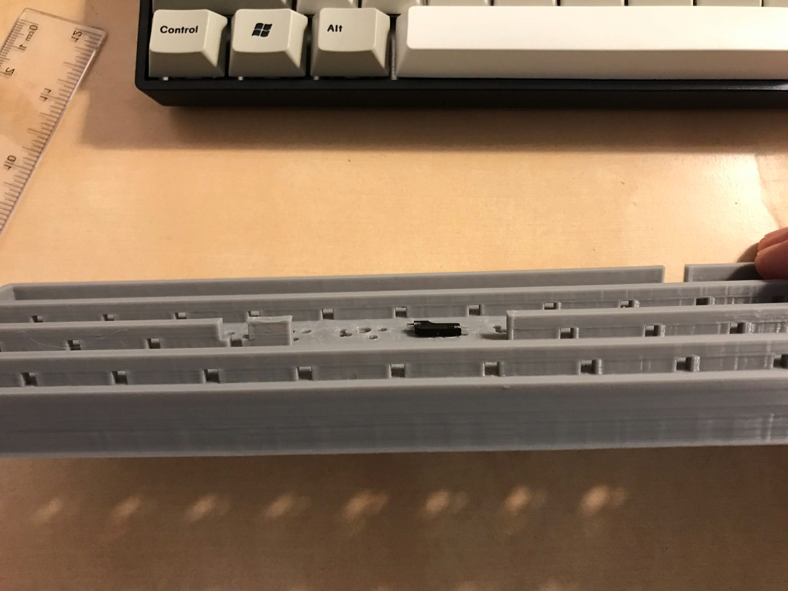
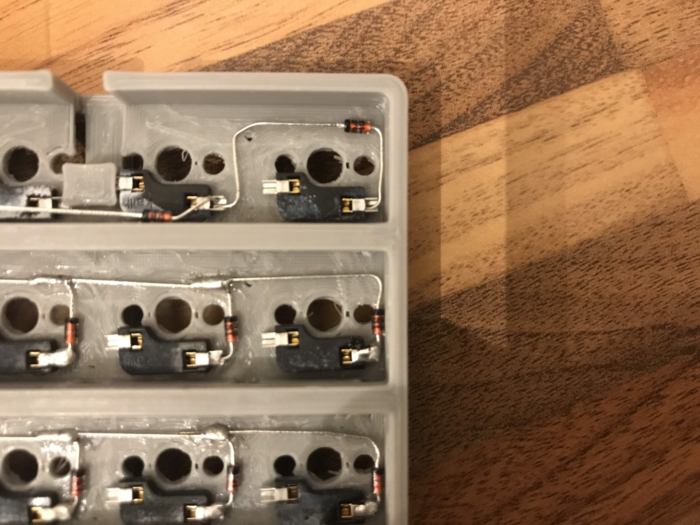

# Assembling Planckton

## 1. Preparing the PCB 
 

Once you have printed your PCB, the first thing is to pry out the excess plastic in the switch slots. They are fairly easy to pull out, I used a pair of [flush pliers](https://www.aliexpress.com/item/P00337-Electrical-Wire-Cable-Cutters-Cutting-Side-Snips-Flush-Pliers-Nipper-Hand-Tools-Herramientas/32686834481.html?spm=2114.search0104.3.9.99665f6eQu8w5k&ws_ab_test=searchweb0_0,searchweb201602_5_10065_10068_10130_10547_319_317_10548_10696_10192_10190_453_10084_454_10083_10618_10307_10820_10301_10821_538_10303_537_536_10059_10884_10887_100031_321_322_10103,searchweb201603_2,ppcSwitch_0&algo_expid=9b10be04-4f9c-4a78-b933-385b893fbfa9-1&algo_pvid=9b10be04-4f9c-4a78-b933-385b893fbfa9):

Once you've finished, your PCB will look like below: 

Next thing (this is somewhat dependent on your print quality), I suggest with a screw driver go through/poke through each of the holes and ensure they're all clear. You don't want any of your filament to be covering the hole as this will make it harder for your hotswap sockets and switches to go in. 

Once you've cleared the holes, using some sand paper, sand down each of the housings to ensure the excess plastic gets shredded off. This will ensure the switch is nice and flush.

---

## 2. Gluing the Hotswap sockets
Next step is to glue our hotswap sockets. Since the sockets are quite small, getting a glue with a 'precision' end will make this a bit easier. You'll notice that your socket will slot in perfectly like shown below: 

Once you've figured out how they fit, start gluing!

> In the current revision there was a slight issue with the far left row lacking a bit of space for the sockets. The fix is to increase spacing by 1/2mm or so, but as a short-term fix, you can clip some of the sockets or just brute force it in.  

> Also note the socket closest to where the power cable will slot in the plastic house. The house was added in revision 2, due to an issue with unplugging the power cable causing the microcontroller micro usb to snap clean off!

Once you're done, your PCB will look like below:

---

## 3. Soldering the Diodes
The next step is to solder our 48 diodes. For those of you who have little to no soldering experience, [here](https://www.reddit.com/r/MechanicalKeyboards/comments/9h4z6x/how_to_solder_xpost_from_rcoolguides/) is a really simple guide on how to do it.

Setup your soldering work station:

Start from the bottom right and begin by bending and clipping the diode so it fits nicely:

> Ensure you have the diode the right way round and that it has a little bit of clearance around the holes

Next, solder the diode:

You now want to repeat this pattern, but you want the diodes to create a horizontal chain (for the row):

> You might find it easier to get some small narrow weight to hold the diode in place whilst you're soldering, or it might move. 

Repeat this until you have completed the first row:

> You should also solder the final socket, like shown in the next image. 

Once you've done the first row, repeat for the next two rows, until you end up with something similar to below:

The final row is by far the trickiest due to the power input. You can bend the first diode like this:

And bend the second one like below:

Now solder:

The next diode is also quite tricky, but below is how I did it, along with the next few:

Your rev of Planckton will be slightly different to this, but here is the completed top row:

Once done, it will look something like this:

